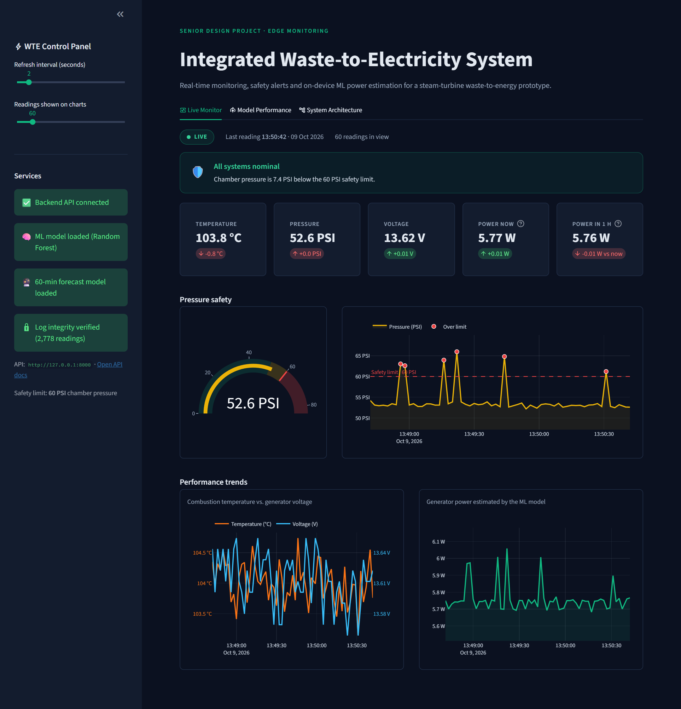
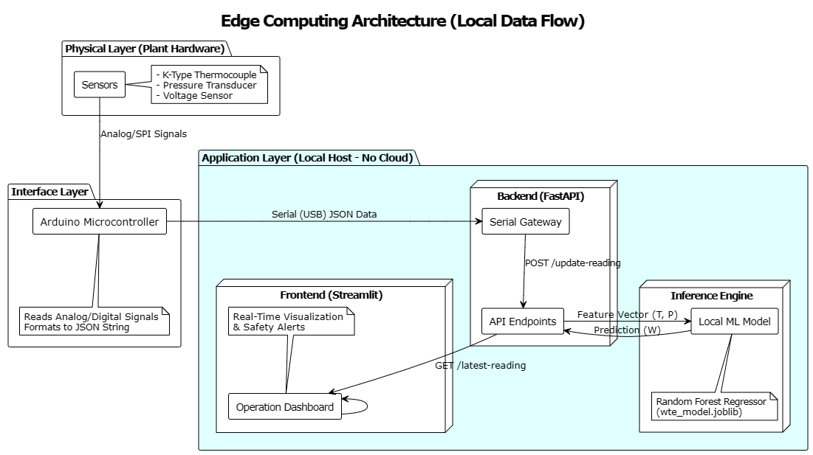
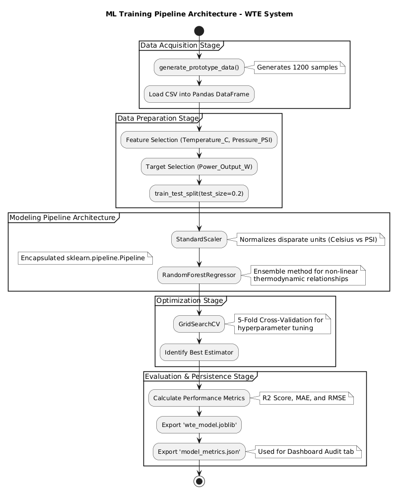

# Integrated Waste-to-Electricity System

Real-time monitoring, safety alerting and on-device machine-learning power estimation for a
steam-turbine **waste-to-energy (WTE)** prototype, built as a senior design project.

Sensors on the boiler stream temperature, pressure and voltage through an Arduino to a local
FastAPI backend. A Random Forest model estimates the generator's power output from every reading,
a second one forecasts the power 60 minutes ahead, and a Streamlit dashboard shows everything live,
raising an alarm the moment chamber pressure reaches the safety limit. Everything runs on the local
machine, with no cloud services involved.



## Features

- **Live monitoring** of combustion temperature, chamber pressure and generator voltage
- **Safety alerting**: a pressure gauge and an emergency banner when pressure reaches the limit (60 PSI by default)
- **ML power estimation**: a Random Forest regressor (R² = 0.911, MAE = 0.091 W) predicts power output from temperature and pressure
- **60-minute power forecast**: a second Random Forest forecasts power an hour ahead from the last 30 minutes of readings and the operator's feed log (R² = 0.909 on held-out runs, **trained on synthetic data**; see [60-minute forecast](#60-minute-forecast))
- **Model audit view** with validation metrics, feature importance and tuned hyperparameters
- **Hardware or simulation**: run against the real Arduino rig, or use the built-in simulator of the plant's dynamics
- **Edge architecture**: SQLite storage and local inference with no external dependencies
- **Tamper-evident log**: readings are append-only and SHA-256 hash-chained; any edit or deletion is detected (see [Data integrity](#data-integrity))

## Architecture



| Component | File | Role |
|---|---|---|
| Serial bridge | [`wte/serial_bridge.py`](wte/serial_bridge.py) | Reads JSON lines from the Arduino over USB and forwards them to the API |
| Simulator | [`wte/simulator.py`](wte/simulator.py) | Posts readings and feed-log entries from the plant model when no hardware is attached |
| Plant model | [`wte/plant.py`](wte/plant.py) | Synthetic boiler dynamics: warm-up, hourly waste feeds, drift, sensor noise, pressure spikes |
| Backend API | [`wte/api.py`](wte/api.py) | Validates and stores readings and feeds in SQLite; serves power estimates and the forecast |
| Dashboard | [`wte/dashboard.py`](wte/dashboard.py) | Streamlit operations dashboard |
| Model training | [`wte/train_model.py`](wte/train_model.py) | Generates the calibrated dataset, tunes and trains the power estimator |
| Forecast | [`wte/forecast.py`](wte/forecast.py), [`wte/train_forecast.py`](wte/train_forecast.py) | Forecast features (shared by training and the API) and forecast training |
| Configuration | [`wte/config.py`](wte/config.py) | Paths, API URL and safety limit (overridable with environment variables) |

More diagrams (class, sequence, use-case, ML pipeline) are in [`docs/diagrams`](docs/diagrams).

## Getting started

Requires **Python 3.10+**.

```bash
git clone https://github.com/O5mu/waste-to-electricity-system.git
cd waste-to-electricity-system
python -m venv .venv
.venv\Scripts\activate          # macOS/Linux: source .venv/bin/activate
pip install -r requirements.txt
```

Run each of these in its own terminal from the project root:

```bash
# 1. Backend API (docs at http://127.0.0.1:8000/docs)
uvicorn wte.api:app --reload

# 2. A data source: the simulator (--backfill seeds 90 min of history so the forecast shows at once)...
python -m wte.simulator --backfill 90
#    ...or the real hardware
python -m wte.serial_bridge --port COM3

# 3. Dashboard (opens http://localhost:8501)
streamlit run wte/dashboard.py
```

Both trained models are included in [`models/`](models). To retrain them:

```bash
python -m wte.train_model      # power estimator
python -m wte.train_forecast   # 60-minute forecast (simulates 40 plant runs, about a minute)
```

### Simulator options

| Option | Default | Description |
|---|---|---|
| `--interval` | `2` | Seconds between readings |
| `--fault-rate` | `0.1` | Probability of a high-pressure spike (`0` = stable operation) |
| `--backfill` | `0` | Minutes of past readings to write straight into the local database first (empty or older log only) |
| `--api-url` | `http://127.0.0.1:8000` | Backend URL |

### Configuration

| Environment variable | Default | Description |
|---|---|---|
| `WTE_API_URL` | `http://127.0.0.1:8000` | Backend URL used by the dashboard, simulator and bridge |
| `WTE_PRESSURE_LIMIT_PSI` | `60` | Chamber pressure that triggers the safety alert |
| `WTE_DB_PATH` | `data/wte_system.db` | SQLite database location |

## API

| Method | Endpoint | Description |
|---|---|---|
| `GET` | `/health` | Service status, model status and safety limit |
| `POST` | `/update-reading` | Store a reading: `{"temperature": 101.2, "pressure": 55.4, "voltage": 13.6}` |
| `GET` | `/latest-reading` | Most recent reading with `predicted_power_w` and `is_critical` |
| `GET` | `/history?limit=30` | Last *N* readings (oldest first) with predictions |
| `POST` | `/feed` | Log a batch of waste loaded now and the plan for the next two: `{"mass_kg": 0.8, "next_feed_in_min": 55, "next_mass_kg": 0.7, "then_feed_in_min": 115, "then_mass_kg": 0.75}` |
| `GET` | `/forecast` | Power expected 60 minutes after the latest reading, or why it is not available yet |
| `GET` | `/forecast/metrics` | Validation metrics of the forecast model |
| `GET` | `/integrity` | Re-verify the hash chain over every stored reading |
| `GET` | `/model/metrics` | Validation metrics of the trained model |

## Data integrity

The sensor log in SQLite is **tamper-evident** ([`wte/database.py`](wte/database.py)):

- **Append-only.** Database triggers reject every `UPDATE` and `DELETE` on `sensor_readings`.
- **Hash-chained.** Each reading stores a SHA-256 hash of its values plus the previous reading's hash, so
  changing or removing any row breaks the chain from that row onward, even after dropping the triggers
  or editing the file directly.
- **Verified.** `GET /integrity` recomputes the chain and returns the first bad row; the dashboard sidebar
  shows the result.

Removing only the newest rows leaves a shorter but valid chain. To catch that, store the `head_hash` returned
by `/integrity` somewhere else (for example, in an operator's log) and compare it later.

## Hardware

| Sensor | Measures |
|---|---|
| K-type thermocouple | Combustion temperature (°C) |
| Pressure transducer | Chamber pressure (PSI) |
| Voltage sensor | Generator output voltage (V) |

The Arduino prints one JSON object per line at 115200 baud, for example
`{"temperature": 101.2, "pressure": 55.4, "voltage": 13.6}`.

## Machine-learning model

The model is a `StandardScaler` → `RandomForestRegressor` pipeline, tuned with 5-fold `GridSearchCV`
on 1,200 samples calibrated to the prototype's ~6 W generator (temperature 94–118 °C,
pressure 50–80 PSI) and evaluated on a 20 % hold-out set.

| Metric | Value |
|---|---|
| R² | 0.911 |
| MAE | 0.091 W |
| RMSE | 0.114 W |
| Feature importance | Temperature 75 % · Pressure 25 % |



## 60-minute forecast

The dashboard's **Forecast · 60 min** card shows the generator power expected an hour from now.

**The data is synthetic.** No long recordings of the real plant exist, so the model is trained on
runs simulated by [`wte/plant.py`](wte/plant.py): the boiler warms up from first steam, the operator
loads a weighed batch of waste roughly every hour, each batch burns off over about half an hour,
the waste's calorific value drifts and the heat exchanger slowly fouls. Feed plans slip by a couple of
minutes and a few percent of weight, and readings carry sensor noise and pressure spikes. The live
simulator runs the same model, so the forecast behaves the same way in the demo.

**Inputs.** Readings are averaged into 1-minute bins. The features are the last 30 minutes of
temperature, pressure, voltage and estimated power (current values, lags, rolling means, slopes)
plus the operator's feed log: when the last batch went in and how heavy it was, and the plan for the
next two. From the log the model also gets an estimate of how much unburnt waste will be in the
chamber over the next hour. Sensors alone cannot see an upcoming feed: without the feed log the same
model reaches only R² = 0.42 on the same held-out runs.

**Validation.** 40 simulated runs (6 to 14 hours each) are split in time order: hyperparameters are
tuned with time-ordered cross-validation on the first 32 runs, and the model is scored on the last 8,
which it never saw.

| Metric (8 held-out runs) | Forecast | Baseline: "power in 60 min = power now" |
|---|---|---|
| R² | 0.909 | -0.04 |
| MAE | 0.026 W | 0.099 W |
| RMSE | 0.037 W | |

Regenerating the simulated runs with three other random seeds gave R² between 0.896 and 0.918.

The forecast is available after 30 minutes of continuous readings and at least one logged feed; a gap
of more than 2 minutes in the readings counts as a restart.

## Tests

```bash
pip install pytest httpx
pytest
```

The suite in [`tests/`](tests) checks that the log verifies, that edits and deletes are rejected, that
tampering behind the triggers is detected, and that databases from earlier versions are upgraded. It
also covers the forecast: the plant model stays in the estimator's range, gaps start a new run, the
forecast waits for enough history and a feed log, the `/forecast` endpoint works end to end after a
backfill, and the model beats the no-forecast baseline.

## Project structure

```
├── wte/                 # Application package
│   ├── api.py           # FastAPI backend
│   ├── dashboard.py     # Streamlit dashboard
│   ├── database.py      # SQLite access (append-only, hash-chained)
│   ├── simulator.py     # Sensor simulator
│   ├── plant.py         # Synthetic plant dynamics (simulator + forecast training data)
│   ├── serial_bridge.py # Arduino → API bridge
│   ├── train_model.py   # Dataset generation & power-estimator training
│   ├── forecast.py      # 60-minute forecast features
│   ├── train_forecast.py # Forecast training on simulated runs
│   └── config.py        # Settings
├── tests/               # pytest suite (log integrity, forecast)
├── models/              # Trained models + validation metrics
├── data/                # Training dataset (SQLite DB is created here at runtime)
├── docs/                # Diagrams and screenshots
└── .streamlit/          # Dashboard theme
```
